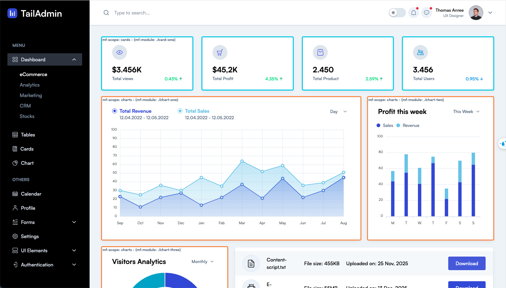

# Admin Microfrontends: Admin Dashboard with Microfrontends

This project showcases microfrontends by building a modular Admin Dashboard. Three independent React applications integrate seamlessly to form a cohesive web app

Demo here [Demo](https://thiendang.github.io/admin-microfrontends).

## Table of Contents

- [Overview](#overview)
- [Project Structure](#project-structure)
- [Getting Started](#getting-started)
- [How it works](#how-it-works)
- [Cool tricks with Microfrontends](#cool-tricks-with-microfrontends)
- [Credits](#credits)

## Overview

Microfrontends are an architectural style that promotes building complex UIs from independent, deployable React applications. 

This project demonstrates how this approach enables multiple teams to work on separate sections of an Admin Dashboard application, fostering modular development and faster delivery.

## Project Structure

The [shell](./shell/README.md) project acts as the central hub, orchestrating three independent web applications, [cards](./mf-cards/README.md), [tables](./mf-tables/README.md), [charts](./mf-charts/README.md) to deliver a seamless user experience for the Admin Dashboard.

The Admin Dashboard is built with modular microfrontends, each responsible for a specific area

[](https://thiendang.github.io/admin-microfrontends)

In the image above, the colored outlines visually represent which project is responsible for rendering each section of the page.

## Getting Started

To launch the Admin Dashboard locally and experience microfrontends in action, run the following command:

```sh
git clone https://github.com/thiendang/admin-microfrontends.git
pnpm i
pnpm run -r copy:env
pnpm run --parallel -r start
```

and open https://localhost:4000 in the browser.

This command initiates the development servers for the three previously mentioned frontend projects (cards, tables, charts) on separate ports. 

Additionally, it starts the [API](./api/README.md) and commences the process of building the [microfrontends library](./microfrontends/README.md).

## How it works

Each project uses [Webpack's Module Federation](https://webpack.js.org/concepts/module-federation/) to expose files.

See [example in mf-charts](./mf-charts/config-overrides.js), where we

- expose [3 apps](./mf-charts/config-overrides.js),
- ensure there is [a remoteEntry.js file](./mf-charts/config-overrides.js) which tells webpack how to find these files.
- and [give them all a unique name identifier](./mf-charts/config-overrides.js), which we get from the package.json.

The above actions form 3 concepts called `module`, `entry`, and `scope` respectively, where a microfrontend can expose one or more `module` apps, under the same `scope`, with an `entry` that tells webpack how to find them. These concepts are helpful for understanding what comes next.

### Dynamic Remote Resolution

This project uses Webpack Module Federation's [Promise-based Dynamic Remotes](https://webpack.js.org/concepts/module-federation/#promise-based-dynamic-remotes), where instead of having to manually specify each remote in the shell project, we can resolve the values for their `scope`, `module` and `entry` at runtime.

When running locally, these values are obtained from the microfrontend manifests served by the [api project](./api/README.md) at http://localhost:3333.

### What are microfrontend manifests?

To aid in dynamic remote resolution, each microfrontend publishes a `microfrontend-manifest.json` file that contains information about how to load itself.

See [example in mf-charts](./mf-charts/public/microfrontend-manifest.json), where we have a

- scope: `charts`
- module: `./unused-root-module.js`
- entry: `http://localhost:4003/remoteEntry.js`

Notice that the `module: ./unused-root-module.js` is incorrect compared to the [3 exposed apps](./mf-charts/config-overrides.js) in its webpack module federation config. This is because the manifest can have multiple [slots](#what-are-slots) modules, so it helps to reserve the root module for route slots.

#### What are Slots?

[Slots](./mf-charts/public/microfrontend-manifest.json) are how we are able to express within our `microfrontend-manifest.json` file, that we have exposed more than one app in our module federation config.

Each slot represents an exposed interface, that:

- inherits its `scope` and `entry` from the root manifest,
- may inherit its `module` from the root manifest,
- may contain other parameters that can be used in choosing which slots get rendered.

Slots can be rendered either:

- directly on the route with [MicrofrontendScreen](./microfrontends/src/components/MicrofrontendScreen/README.md), making them a route-level slot.
  - To specify routes, you would use the `slots.routes` property of the microfrontend-manifest.json file, which works:
    - just the same as other slots,
    - except it requires a `"route": "/dashboard/*"` property, specifying its route.
  - You can get away with having one route slot that resides in the root, especially if your exposed app includes its own BrowserRouter and handles its own navigation, relying on the `navigate` [mount prop](#what-are-mount-props) when it needs to navigate to a route controlled by its parent.
  - Or you can choose to expose an app per route.
    - just the same as other slots,
    - and lets you add a `"route": "/dashboard/*"` property, specifying its route.
- directly within an HTML Element with [MicrofrontendSlot](./microfrontends/src/components/MicrofrontendSlot/README.md), making them a non route-level slot.

#### Loading Microfrontends

When matching slots are found, their:

- `entry` script (usually `remoteEntry.js`) is loaded on the DOM
- we initialize the exposed `module` we want
- using the exposed [mount and unmount functions](#mount-and-unmount), we can:
  - `mount` the app to an HTML element
  - and `unmount` when done.

#### Mount and Unmount?

Every exposed app exports as default:

```js
export default {
  mount: (container, props) => {
    return () => unmount();
  },
  unmount: (container) => {},
};
```

such as [in mf-charts](./mf-charts/src/main.tsx).

#### What are mount props?

the [mount function's props parameter](./microfrontends/src/components/Microfrontend/Microfrontend.types.ts) contain data and functions we pass down to every microfrontend.

Having such a simple interface instead of exporting say a React component directly is a powerful concept because it lets us abstract away the moving parts of different frameworks. Technically, this can be used to load Angular, Vue, Solid, HTMX, etc, because all we need is a way to mount HTML with behaviours to an element, and unmount it when done.

### Communication among microfrontends

One of the properties of the microfrontend-manifest.json I did not talk about is the `events`, which may expose a mapping of event names to a [JSON schema](https://json-schema.org/) object that describes its data.

Using the Microfrontend Context, we can [pass an eventBus](./shell/src/components/AppRouter.tsx) to our microfrontends, which they can use to communicate across the various apps.

## Cool tricks with Microfrontends

All the above sounds like a lot if there is no clear advantage. Besides the team and management advantages of independence and being able to iterate simultaneously on multiple parts of the product, here are some technical advantages to using this architectural pattern.

### 1. Show off your work to a colleague

Imagine you're working on the charts project, and you've deployed your work to staging, so it lives at `https://staging.admin-dashboard.com/mfs/charts/` while production is at `https://admin-dashboard.com`.

You could ensure your page takes an `?override_manifest` query string, so you send a URL like:

```txt
https://admin-dashboard.com?override_manifest=https://staging.admin-dashboard/mfs/charts/microfrontend-manifest.json
```

to your colleague, and they would see the new funky thing you have in staging, in the production environment, because it would load the remoteEntry.js from staging.

### 2. Debug production in localhost

A tangent of the above is that when you want to test a new feature in production, or debug a problem, you don't need to wait until your code gets to production, because you can load the following URL:

```txt
https://admin-dashboard.com?override_manifest=http://localhost:4003/microfrontend-manifest.json
```

and instantly have your localhost-served copy of the charts project, running in the production web page, with webpack hot-reload.

Be sure to limit the domains that can be used to override your manifests to `localhost` and other domains you control.

### 3. Instant Rollbacks

Because we are dealing with SPAs, we can easily maintain the say last 50 deployed versions of each microfrontend, because storage and CDN are relatively cheap.

This means that if something happens with the latest 1.2.3 version of the charts such as `https://admin-dashboard.com/mfs/charts/1.2.3/remoteEntry.js`, then we can quickly change the remoteEntry.js location to one we know that works e.g. `https://admin-dashboard.com/mfs/charts/1.2.0/remoteEntry.js`, and all your users need to do is refresh to get the latest.

You could even push a notification to the web page to prompt them to refresh when this happens.

## Credits

The original html+css code used for this demo is by [TailAdmin](https://react-demo.tailadmin.com/).
